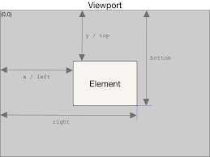

## DOMインターフェイス

HTML上の要素は**タグ**で、JavaScript上は**DOMオブジェクト**で表される。  
DOMは、DOMインターフェイスやDOM APIとも呼びます。DOMインターフェイスを持つDOMオブジェクトを通してHTMLの情報を扱います。
> **DOM**は、JavaScriptからHTMLの情報を取得・変更するためのインターフェイス**

[WHATWG](https://spec.whatwg.org/) -- HTML、DOMなどブラウザの関連技術に関する使用を策定している団体。

### DOMツリー

DOMオブジェクトを取得するには、`Document`オブジェクトを使う。Documentオブジェクトには、HTMLの構造がDOMオブジェクトに変換された状態で、ツリー構造で格納されています。このツリー構造を**DOMツリー**と呼びます。

DOMツリーを構成する個々のオブジェクトは、`Node`と呼びます。Nodeには、テキストやHTMLコメント、またHTMLタグなどの種別があります。

### Elementの取得

Nodeの中でもHTMLタグのみを表す場合には`Element`と呼びます。Elementとは、[Nodeの種別](https://developer.mozilla.org/ja/docs/Web/API/Node/nodeType)がElementタイプ(HTML要素)のものを指します。

> [Element](https://developer.mozilla.org/zh-CN/docs/Web/API/Element)と[Node](https://developer.mozilla.org/zh-CN/docs/Web/API/Node)は、両方ともコンストラクタによって作成されたオブジェクトのことだと思ってください（それぞれElementコンストラクタ、Nodeコンストラクタを継承したコンストラクタから作成されます。）また、ElementはNodeを継承しているため、Nodeオブジェクトで使用可能なプロパティやメソッドはElementオブジェクトからも使用できます。

ElementとNodeツリーは、それぞれDocumentオブジェクト(document)の`children`、`childNodes`に格納されています。

親子関係を解決するDOMインターフェイスのプロパティ
| プロパティ | 戻り値のタイプ | 説明 |
|-----------|---------------|------|
| parentElement     | Element        | 親のElementを返す |
| parentNode        | Node           | 親のNodeを返す |
| children          | HTMLCollection | 子Elementを含む配列風オブジェクトを返す |
| childNodes        | NodeList       | 子Nodeを含む配列風オブジェクトを返す |
| firstElementChild | Element        | childrenで取得される配列風オブジェクトの最初の要素を返す |
| firstChild        | Node           | childNodesで取得される配列風オブジェクトの最初の要素を返す |
| lastElementChild  | Element        | childrenで取得される配列風オブジェクトの最後の要素を返す |
| lastChild         | Node           | childNodesで取得される配列風オブジェクトの最後の要素を返す |
| previousElementSibling | Element   | 自要素と兄弟関係にある1つ前のElementを返す |
| previousSibling        | Node      | 自要素と兄弟関係にある1つ前のNodeを返す |
| nextElementSibling     | Element   | 自要素と兄弟関係にある1つ後のElementを返す |
| nextSibling            | Node      | 自要素と兄弟関係にある1つ後のNodeを返す |

DOMツリー外から取得可能なDOMオブジェクト
| プロパティ | 戻り値のタイプ | 説明 |
|-----------|---------------|------|
| document.body | Element | HTML内の\<body\>のElementを返す |
| document.head | Element | HTML内の\<head\>のElementを返す |
| document.images | HTMLCollection | HTML内の\を含む配列風オブジェクトを返す |
| document.forms | HTMLCollection | HTML内のすべての\<form\>のElementを含む配列風オブジェクトを返す |
| document.embeds | HTMLCollection | HTML内のすべての\<embed\>のElementを含む配列風オブジェクトを返す |

#### セレクタAPI

セレクタAPI（Elementオブジェクトまたはdocumentから利用可能）
| メソッド | 戻り値 | 説明 |
|---------|--------|------|
|`querySelect(selector)`|Element|セレクタ文字列(selector)に一致した最初のElementを取得する|
|`querySelectAll(selector)`|NodeList|セレクタ文字列(selector)に一致したすべてのElementを格納した配列風オブジェクトを取得する|

[セレクタ文字列](https://drafts.csswg.org/selectors/)とは、JavaScriptやCSSのコード内でHTML要素を特定するときに使う文字列のことです。
> [セレクター LEVEL3](https://www.w3.org/TR/selectors-3/)

セレクタAPIで使用可能なセレクタ文字列
| セレクタ文字列 | 説明 |
|---------|--------|
|\*|すべてに一致する|
|E|タグ名(E)に一致|
|#idAttr|idの属性値(idAttr)に一致する|
|.clsAttr|classの属性値(clsAttr)に一致する|
|[attr]|属性名(attr)に一致する|
|[attr]="value"|属性名(attr)の属性値(value)に一致する|
|[attr]^="value"|属性名(attr)の属性値(value)に先頭一致する|
|[attr]$="value"|属性名(attr)の属性値(value)に後方一致する|
|[attr]*="value"|属性名(attr)の属性値(value)に部分一致する|
|S1, S2|セレクタ(S1)またはセレクタ(S2)に一致する。セレクタにおけるOR条件|
|S1S2|セレクタ(S1)かつセレクタ(S2)に一致する。セレクタにおけるAND条件|
|S1 S2|セレクタ(S1)内のセレクタ(S2)に一致する|
|S1 > S2|セレクタ(S1)の子要素に当たるセレクタ(S2)に一致する|
|S1 + S2|セレクタ(S1)の直後にあるセレクタ(S2)に一致する|
|S1 ~ S2|セレクタ(S1)の兄弟関係でS1よりも後ろにある(S2)に一致する|

> [CSS セレクター](https://developer.mozilla.org/ja/docs/Learn/CSS/Building_blocks/Selectors)

#### 特定のElementを取得するメソッド

参考程度  
`getElementById`はパフォーマンスの観点から使われることがあります。  
`getElementsBy*`メソッドはライブ(動的)なコレクションを返します。このようなコレクションは常にドキュメントの現在の状態を反映し、変更があったとき “自動更新” されます。  

特定のElementを取得するメソッド（Elementオブジェクトまたはdocumentから利用可能）
| メソッド | 戻り値 | 説明 |
|---------|--------|------|
|`getElementId("idAttr")`|Element \| null|idの属性値（idAttr）と一致した最初のElementを取得する。一致する要素がない場合、nullが返る|
|`getElementsByClassName("clsAttr")`|HTMLCollection|class属性（clsAttr）を使ってElementが格納された配列風オブジェクトを取得する。一致する要素がない場合、からのHTMLCollectionが返る|
|`getElementByName("nameAttr")`|NodeList|name属性（nameAttr）を使ってElementが格納された配列風オブジェクトを取得する。一致する要素がない場合、からのHTMLCollectionが返る|
|`getElementByTagName("tagName")`|HTMLCollection|タグ（tagName）を使ってElementが格納された配列風オブジェクトを取得する。一致する要素がない場合、からのHTMLCollectionが返る|

### 祖先要素にさかのぼって検索する

closectメソッド
```
let closestElement = element.closest( selector );
```
|  |  |
|--|--|
|**closestElement**|自要素（element）の祖先要素をさかのぼって検索したときに、最初にセレクタ文字列（select）に一致するElementを返します。|
|**element**|Elementオブジェクトを設定します。|
|**selector**|セレクタ文字列を設定します。|

### DOMツリーの構造後にコードを実行

JavaScriptコードの実行時に、まだDOMツリー上に読み込まれていないHTMLタグにアクセスできません。

#### HTML要素が取得できない場合の対処方法
1. scriptタグを&lt;body>の閉じタグの直前に記述する。
2. DOMContentLoadedイベントまたはloadイベント内でコードを実行する。
3. defer属性をscriptタグに付与する。
4. scriptタグにtype="module"を付加する。

## 画面の取得・更新 

### 要素内のコンテンツの取得・変更

|プロパティ|説明|
|----|----|
|innerHTML| 要素内のHTMLの文字列として取得・変更する。HTML取得の場合には、HTMLタグを含む文字列が取得される。また、HTML変更の場合には、HTMLタグがきちんと解釈されて、画面上に表示される |
|textContent| 要素内のテキストを取得・変更する。テキスト取得の場合は、HTMLタグは無視される。また、テキスト変更の場合は、HTMLタグはただの文字列として扱われる |
|innerText<br/><sup>※非推奨</sup>| 要素内のテキストがレンダリングされた状態で取得・変更さる。代わりにtextConentを使用する。 |
|outerText<br/><sup>※非推奨</sup>| innerTextと同じ。代わりにtextContentを使用する |

### 要素の作成

1. document.createElementメソッドを使う
2. ダミーの要素のinnerHTMLに作成したいHTMLを挿入する
3. templateタグを使う

``` js
const newDiv = document.createElement("div")
newDiv.textContent = "Hello World"
document.body.prepend( newDiv )
```

``` js
const htmlStr = `
    <article id="article">
        <h1 id="article-title">記事のタイトル</h1>
        <div class="tag-area">
            <span>タグ：</span><span>スポーツ</span><span>バスケ</span>
        </div>
        <div class="article-body">記事の本文</div>
        <div id="recommend">
            <h2>おすすめの記事</h2>
            <a href="#">ほかの記事</a>
    </article>
`;

function htmlStrToElement( htmlStr ) {
    const dummyDiv = document.createElement( "div" );
    dummyDiv.innerHTML = htmlStr;
    return dummyDiv.firstElementChild;
}

const targetNewElement = htmlStrToElement( htmlStr );
document.body.prepend( targetNewElement );
```

``` html
<body>
    <template id="tmpl">
        <span>テンプレートHTMLを定義</span>
    </template>
    <h1>見出し1</h1>
    <p>段落</p>
    <script>
        const tmpl = document.querySelector( "#tmpl" );
        const targetNewElement1 = tmpl.content;
        document.body.prepend( targetNewElement1 );
    </script>
</body>
```

### 要素の追加・削除

| メソッド | 説明 |
|---------|-----|
|element.append<br/>(node1[, node2, ...])|要素(element)内の最後の子要素としてNode(Elementを含むすべての種別のNode)を挿入する。<br/>Node以外に文字列の挿入も可能|
|element.prepend<br/>(node1[, node2, ...])|要素(element)内の最初の子要素としてNodeを挿入する。<br/>Node以外に文字列の挿入も可能|
|element.before<br/>(node1[, node2, ...])|要素(element)の直前の要素としてNodeを挿入する。<br/>Node以外に文字列の挿入も可能|
|element.after<br/>(node1[, node2, ...])|要素(element)の直後の要素としてNodeを挿入する。<br/>Node以外に文字列の挿入も可能|
|targetElement.<br/>insertAdjacentElement<br/>(position, element)|要素(targetElement)からの相対的な位置(position)を文字列で指定して、Elementオブジェクト（element）を挿入する<br/><table><tr><th rowspan="5" style="vertical-align:text-top;border:0">position</th><th>指定値</th><th>説明</th></tr><tr><td>beforebegin</td><td>targetElementの直前</td></tr><tr><td>afterbegin</td><td>targetElementの開始タグ直後</td></tr><tr><td>beforeend</td><td>targetElementの終了タグ直前</td></tr><tr><td>afterend</td><td>targetElementの直後</td></tr></table>|
|targetElement.<br/>insertAdjcentHTML<br/>(position, htmlStr)|要素（targetElement）からの相対的な位置（position）を指定して、HTML文字列（htmlStr）を挿入する。HTML文字列は、HTMLに解釈されて画面上に表示される。<br/>position:指定値はinsertAdjacentElementと同じ|
|targetElement.<br/>insertAdjcentText<br/>(position, str)|要素（targetElement）からの相対的な位置（position）を指定して、文字列（str）を挿入する。HTMLタグは、ただのテキストとして解釈される。<br/>position:指定値はinsertAdjacentElementと同じ|

要素を削除する場合には、`remove`メソッドを使います。  
| メソッド | 説明 |
|---------|-----|
|element.remove()|自要素（element）を削除する|

1. DOMツリー上の要素の取得・挿入の操作は「要素の移動」になる。
2. 同じ要素を2回挿入するときには複製の操作を行う必要がある。

同じ要素を複数挿入したい場合には、`cloneNode`メソッドでElementオブジェクトを複製します。

```JavaScript
let 複製された要素 = 複製元の要素.cloneNode( フラグ );
```
| | |
|--|--|
|フラグ：|要素を含めるかどうかのフラグです（true \| false）。デフォルトはfalseで、その場合には自要素のタグのみが複製され、その中身の要素は複製されません。trueの場合は、再帰的に子要素、孫要素が複製されます。|

### 要素の属性の取得・変更

要素の属性の取得・変更（Elementのメソッド）
| メソッド | 説明 |
|--|--|
|getAttribute(name)|属性（name）の値を取得する|
|getAttributeNames()|属性名の一覧を取得する|
|setAttribute(name, value)|属性（name）に値（value）を設定する|
|removeAttribute(name)|属性（name）を削除する|
|toggleAttribute(name)|属性（name）の付外しを行う|
|hasAttributes()|属性を持っているか確認する。何かしらの属性を保持している場合にはtrue、保持していない場合にはfalseを返す|
|hasAttribute(name)|特定の属性（name）を持っているか確認する。保持している場合にはtrue、保持していない場合にはfalseを返す|

#### データ属性
データ属性は、ユーザーが独自で値を保持するためのHTML属性です。__データ属性は、`data-*`のような形式であらわされます。__ このようにdata-から始まる属性については、一時的にJavaScriptで使用する値を保持しているものと考えてください。また、JavaScriptからデータ属性へアクセスするときには、`dataset`という特別なプロパティを通してアクセスします。なお、属性値は文字列として取得されるため、数値を扱いたい場合にはNumberなどを使って数値に変換してください。
``` html
<div id="sum" data-base-val1="10" data-base-val2="20"></div>
<script>
    const sum = document.querySelector( "#sum" );
    const val1 = parseInt( sum.dataset.baseVal1 );
    const val2 = parseInt( sum.dataset.baseVal2 );
    sum.dataset.sumVal = val1 + val2;
    sum.textContent = val1 + val2;
</script>
```

### 要素の位置と大きさの取得と変更

HTML/DOMでは、要素の大きさや位置や状況に合わせて、3種類の方法で取得できます。この3種類の方法は、それぞれclient、offset、scrollから始まるプロパティ名で定義されています。

位置情報を保持するElementオブジェクトのプロパティ
|プロパティ|説明|
|--|--|
|clientLeft<br/>clientTop|自要素の左ボーダーの幅（clientLeft）、上ボーダーの幅（clientTop）のpx数を整数値で返す。**読み取り専用**|
|offsetLeft<br/>offsetTop|offsetParent要素から自要素のボーダー(border)の外側（左：offsetLeft、上：offsetTop）までのpx数を整数値で返す。**読み取り専用**|
|scrollLeft<br/>scrollTop|スクロール可能なコンテンツ領域の端からパディング（padding）の端（左：scrollLeft、上：scrollTop）までのpx数を整数値で返す。値を変更した場合は、変更したpx分のスクロールが行われる。|

大きさを保持するElementオブジェクトのプロパティ
|プロパティ|説明|
|--|--|
|clientWidth<br/>clientHeight|要素のパディング（padding）までを含む矩形の横幅（clientWidth）、高さ（clientHeight）のpx数を整数値で取得する。スクロールバーは含まない。**読み取り専用**|
|offsetWidth<br/>offsetHeight|要素のボーダー（border）までを含む矩形の横幅（offsetWidth）、高さ（offsetHeight）のpx数を整数値で取得する。スクロールバーがあるときはスクロールバーも含む。**読み取り専用**|
|scrollWidth<br/>scrollHeight|画面表示されていないスクロール可能なコンテンツ領域を含む矩形の横幅（scrollWidth）、高さ（scrollHeight）のpx数を整数値で取得する。**読み取り専用**|

- コンテンツ表示領域（content）  
    要素の中身を表示する領域です。タグ内の文字列や画像などがこの領域に表示されます。
- パディング（padding）  
    CSSのpaddingを使って余白を設けた場合には、ボーダーの内側に余白が挿入されます。
- ボーダー（border）  
    CSSのborderを使って要素の周囲に枠線を表示すると、paddingの外側に枠線が表示されます。
- マージン（margin）  
    CSSのmarginを使って余白を設けた場合には、ボーダーの外側に余白が挿入されます。

> offsetParentとは、スタイルのpositionプロパティにstatic以外の値が設定されている最初の祖先要素のことです。見つからない場合には、bodyタグになります。また、offsetParent要素は、offsetParentプロパティを通して確認できます。


### 位置や大きさを確認するためのメソッド

より詳細な要素の位置や大きさを確認するには、`getBoundingClientRect`メソッドを使います。

``` js
const domRect = element.getBoundingClientRect();
```
|  |  |
|--|--|
|element:|Elementオブジェクトを設定します。|
|domRect:|要素の位置と大きさを表すプロパティを格納したオブジェクト（DOMRect）を返します。|

プロパティを格納したオブジェクト（DOMRect）
```
{
    left: ビューポートの左端から枠線（border）の左端までの距離,
    top: ビューポートの上端から枠線の上端までの距離,
    right: ビューポートの左端から枠線の右端までの距離,
    bottom: ビューポートの上端から枠線の下端までの距離,
    x: leftと同じ,
    y: topと同じ,
    width: 枠線とパディング（padding）を含めた横幅（offsetWidthと基本同じ）,
    height: 枠線とパディングを含めた縦幅（offsetHeightと基本同じ）
}
```

getBoundingClientRectで取得した要素の位置情報の値は、**ビューポートと要素の枠線（border）の外側境界の距離で計算**されます。**ビューポート**とは、Webページ中のブラウザ画面に表示されている領域のことです。



#### レイアウト幅とレンダリング幅

レイアウト幅とは、CSSのwidthやheightで指定された幅のことです。一方、レンダリング幅は、実際に画面上に表示されるときの幅のことです。基本的にレイアウト幅とレンダリング幅は一致しますが、CSSのtransformというプロパティを指定したときに値が異なる場合があります。

レンダリング幅（実際に画面に表示されるときの要素の幅）を取得したい場合には、`getBoundingRect`を使う必要があります。

## スタイルの変更

### style属性の変更

```
Elementオブジェクト.style.CSSプロパティ名 = 設定したい値;
```

|  |  |
|--|--|
|Elementオブジェクト|スタイル（見栄え）を変更したい要素。|
|CSSプロパティ|CSSのプロパティ<sup>※</sup>を設定します。例えば、文字色を変更したい場合には、colorになります。<br/><small>※ハイフン（-）をはさむプロパティ名では、キャメルケースを使います。例えば、CSSのbackground-colorプロパティの値を操作したい場合には、Elementオブジェクト.style.backgroundColorの値を変更します。</small>|

### classListを使ったスタイルを変更

JavaScriptからclass属性の値を操作する場合には、Elementオブジェクトの**classListプロパティ**に格納されている、次のメソッドを使います。

**class属性にクラス（className）を追加する**  
Elementオブジェクト.classList.add( "className" );  
&lt;div class=""> ➡変更後➡ &lt;div class="className">

**class属性にクラス（className）を削除する**  
Elementオブジェクト.classList.remove( "className" );  
&lt;div class="className"> ➡変更後➡ &lt;div class="">

**class属性にクラス（className）を付外しする**  
Elementオブジェクト.classList.toggle( "className" );  
&lt;div class=""> ⇦変更後⇒ &lt;div class="className">

**クラス（className）がclass属性内に存在するかを確認する**  
Elementオブジェクト.classList.contains( "className" ); ーーー 存在する場合にはtrueが返る

